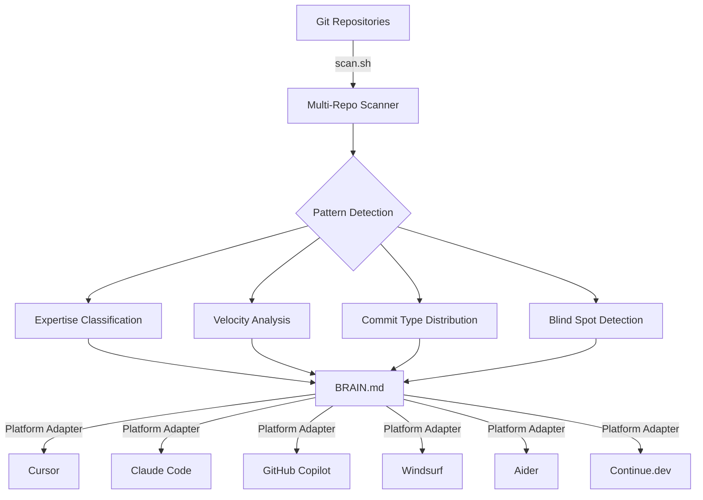
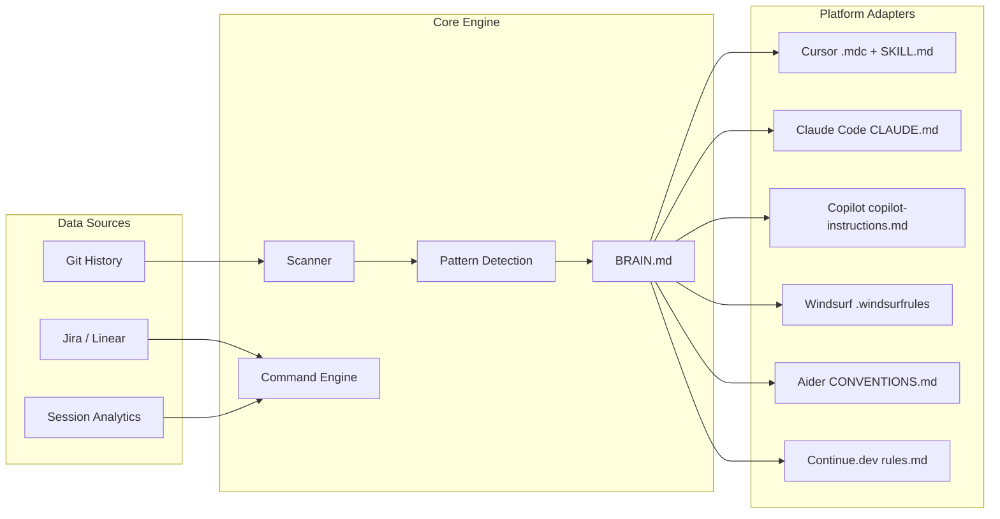

<p align="center">
  <h1 align="center">Engineer Brain</h1>
  <p align="center">
    <strong>A persistent engineering context layer for AI coding assistants.</strong>
  </p>
  <p align="center">
    <a href="https://github.com/Hrithik-Gavankar/engineer-brain/blob/main/LICENSE"></a>
    <a href="https://github.com/Hrithik-Gavankar/engineer-brain/stargazers"></a>
    <a href="https://github.com/Hrithik-Gavankar/engineer-brain/issues"></a>
    
    
  </p>
</p>

<p align="center">
  <a href="#quick-start">Quick Start</a> •
  <a href="#how-it-works">How It Works</a> •
  <a href="docs/brain-spec.md">BRAIN.md Spec</a> •
  <a href="docs/architecture.md">Architecture</a> •
  <a href="docs/roadmap.md">Roadmap</a> •
  <a href="docs/faq.md">FAQ</a>
</p>

---

## The Problem

AI coding assistants understand code. They don't understand *engineers*.

Every session starts from zero. Your AI doesn't know your expertise, your active projects, your team conventions, or your career trajectory. You re-explain context dozens of times a day across multiple tools — burning cognitive energy on something a machine should handle.

Prompts are ephemeral. Chat history is tool-locked. System instructions go stale the moment you write them.

**Engineering context should be portable, persistent, and self-evolving.**

---

## The Solution

Engineer Brain creates a **versioned engineering profile** — stored as a simple Markdown file called `BRAIN.md` — that follows you across every AI coding assistant you use.

It's not another AI tool. It's a **context layer** that makes every AI tool better.

```
┌─────────────────────────────────────────────────────┐
│                   Your Git History                    │
└─────────────────────┬───────────────────────────────┘
                      │
                      ▼
┌─────────────────────────────────────────────────────┐
│              Engineer Brain Scanner                   │
│   (commits, branches, patterns, velocity, expertise) │
└─────────────────────┬───────────────────────────────┘
                      │
                      ▼
┌─────────────────────────────────────────────────────┐
│                    BRAIN.md                           │
│   (your living, versioned engineering profile)       │
└─────────────────────┬───────────────────────────────┘
                      │
          ┌───────────┼───────────┐
          ▼           ▼           ▼
     ┌─────────┐ ┌─────────┐ ┌─────────┐
     │ Cursor  │ │ Claude  │ │ Copilot │  ...
     │         │ │  Code   │ │         │
     └─────────┘ └─────────┘ └─────────┘
```

---

## Why Engineer Brain Exists

| Without Engineer Brain | With Engineer Brain |
|------------------------|---------------------|
| Re-explain your stack every session | AI loads your full profile automatically |
| Generic suggestions that ignore your expertise | Responses tailored to your skill level and goals |
| Standups written from memory | Paste-ready standups generated from git history |
| Quarterly reviews are a scramble | Structured reviews with real metrics, auto-generated |
| Context locked inside one tool | Same brain across 6+ platforms |
| Static system prompts that decay | Self-updating profile that evolves with your work |

---

## How It Works



**Three layers:**

1. **Scanner** — Collects raw data from your git history across all repositories
2. **Brain** — A living Markdown document (`BRAIN.md`) that structures your engineering identity
3. **Adapters** — Platform-specific context files that feed your brain into each AI tool

---

## What Is BRAIN.md?

`BRAIN.md` is to engineers what `README.md` is to projects.

It's a structured Markdown file that documents *you* — your skills, your work patterns, your active projects, your growth trajectory. It's designed to be consumed by AI assistants, providing them deep context about the human they're helping.

```markdown
# Jane Doe — Engineering Brain

## Identity
- Name: Jane Doe
- Role: Senior Backend Engineer, Payments Team, Stripe
- Experience: 7 years
- Goal: Staff Engineer

## Expertise Map
### Strong
- Distributed systems (designed payment routing at scale)
- Go, Python, PostgreSQL
### Growing
- Kubernetes operator development
- Team leadership

## Work Patterns
- Peak hours: 9AM–1PM PST
- Style: Test-first, small PRs, security-conscious
- Fix-to-feature ratio: 35% fix, 45% feat, 20% refactor

## Current Sprint
- Active: payment-retry-redesign (branch: feat/retry-v2)
- Reviewing: PR #892 (rate limiter changes)
```

> Read the full specification: **[docs/brain-spec.md](docs/brain-spec.md)**

---

## Architecture



> Full architecture documentation: **[docs/architecture.md](docs/architecture.md)**

---

## Platform Support

Engineer Brain works with every major AI coding assistant. Same brain, native format.

| Platform | Context File | Status |
|----------|-------------|--------|
| [Cursor](https://cursor.sh) | `.cursor/rules/engineer-brain.mdc` + `SKILL.md` | ✅ Supported |
| [Claude Code](https://claude.ai/code) | `CLAUDE.md` | ✅ Supported |
| [GitHub Copilot](https://github.com/features/copilot) | `.github/copilot-instructions.md` | ✅ Supported |
| [Windsurf](https://codeium.com/windsurf) | `.windsurfrules` | ✅ Supported |
| [Aider](https://aider.chat) | `CONVENTIONS.md` | ✅ Supported |
| [Continue.dev](https://continue.dev) | `.continue/rules.md` | ✅ Supported |
| [Zed](https://zed.dev) | — | 🗓️ Planned |
| [JetBrains AI](https://www.jetbrains.com/ai/) | — | 🗓️ Planned |

---

## Features

### Commands

| Command | Description |
|---------|-------------|
| `engineer-brain sync` | Generate paste-ready standup notes from git history |
| `engineer-brain update` | Refresh BRAIN.md with latest commits, patterns, and metrics |
| `engineer-brain quarterly` | Generate structured quarterly review with impact numbers |
| `engineer-brain reflect` | Pattern analysis: blind spots, habits, recommendations |
| `engineer-brain scan [days]` | Raw multi-repo git scan output |
| `engineer-brain doctor` | Brain health check with completeness score and growth suggestions |

### Intelligence

- **Auto-expertise classification** — Strong / Growing / Exposure based on commit frequency
- **Pattern detection** — Fix-heavy mode, cooling repos, stale goals, velocity drops
- **Monday-aware standups** — Looks back 3 days on Mondays, skips weekends
- **Blocker detection** — Merge conflicts, CI failures, stale branches
- **Growth coaching** — AI nudges you toward career goals, not just code completion

### Safety

- Never commits without explicit permission
- Never pushes without explicit permission
- Never force-pushes under any circumstance
- Always asks before destructive operations

---

## Quick Start

### Install

```bash
git clone https://github.com/Hrithik-Gavankar/engineer-brain.git
cd engineer-brain
bash install.sh <platform> [workspace_path]
```

### Platforms

```bash
bash install.sh cursor ~/my-workspace
bash install.sh claude-code ~/my-workspace
bash install.sh vscode-copilot ~/my-workspace
bash install.sh windsurf ~/my-workspace
bash install.sh aider ~/my-workspace
bash install.sh continue-dev ~/my-workspace
```

### Configure

1. Edit the installed context file — fill in your name, role, skills, and career context
2. Edit the scanner config — set your workspace path and git author pattern
3. Run `engineer-brain update` in your AI assistant — it auto-populates BRAIN.md from your git history

### Use

```
"engineer-brain sync"        → before standup
"engineer-brain reflect"     → Friday afternoons
"engineer-brain update"      → start of each month
"engineer-brain quarterly"   → before performance reviews
```

---

## Project Structure

```
engineer-brain/
├── README.md                          # You are here
├── LICENSE                            # MIT
├── CONTRIBUTING.md                    # Contribution guidelines
├── CODE_OF_CONDUCT.md                 # Community standards
├── CHANGELOG.md                       # Release history
├── install.sh                         # Universal installer
│
├── core/                              # Platform-agnostic engine
│   ├── BRAIN.md                       # Living document template
│   ├── COMMANDS.md                    # Command definitions & logic
│   ├── CONTEXT.md                     # Context rule template
│   └── scripts/
│       └── scan.sh                    # Multi-repo git scanner
│
├── platforms/                         # Platform-specific adapters
│   ├── cursor/
│   ├── claude-code/
│   ├── vscode-copilot/
│   ├── windsurf/
│   ├── aider/
│   └── continue-dev/
│
├── docs/                              # Documentation
│   ├── architecture.md
│   ├── brain-spec.md
│   ├── vision.md
│   ├── roadmap.md
│   └── faq.md
│
├── examples/                          # Example BRAIN.md profiles
│   ├── backend-engineer/
│   ├── frontend-engineer/
│   ├── devops-engineer/
│   ├── platform-engineer/
│   └── oss-maintainer/
│
├── templates/                         # Starter templates
│   └── BRAIN.md
│
└── .github/                           # GitHub configuration
    ├── ISSUE_TEMPLATE/
    ├── workflows/
    └── PULL_REQUEST_TEMPLATE.md
```

---

## Roadmap

See **[docs/roadmap.md](docs/roadmap.md)** for the full roadmap.

**Near-term:**
- [x] `engineer-brain doctor` — health check and brain completeness score
- [ ] Web dashboard for visualizing patterns
- [ ] Team-level brain (aggregate insights)

**Mid-term:**
- [ ] Zed and JetBrains platform support
- [ ] GitLab/Bitbucket integration
- [ ] Weekly email digest mode
- [ ] MCP server for real-time brain queries

**Long-term:**
- [ ] BRAIN.md ecosystem — importers, exporters, validators
- [ ] Organization-level engineering intelligence
- [ ] Open standard adoption

---

## Contributing

We welcome contributions! See **[CONTRIBUTING.md](CONTRIBUTING.md)** for guidelines.

**Quick ways to contribute:**
- Add support for a new AI platform
- Improve pattern detection heuristics
- Create example BRAIN.md profiles for different engineering roles
- Improve documentation
- Report bugs or suggest features

---

## FAQ

See **[docs/faq.md](docs/faq.md)** for the full FAQ.

**Is this another AI coding tool?**
No. Engineer Brain doesn't write code. It provides context to tools that do.

**Does it send my data anywhere?**
No. Everything stays local — your git history, your BRAIN.md, your context files. Nothing leaves your machine.

**Can I use it with multiple AI tools simultaneously?**
Yes. That's the point. Install once, use everywhere.

---

## License

MIT — use it, fork it, make it yours.

---

<p align="center">
  <strong>The future isn't smarter AI. It's AI that understands engineers.</strong>
</p>

<p align="center">
  Built by <a href="https://github.com/Hrithik-Gavankar">Hrithik Gavankar</a>
</p>
