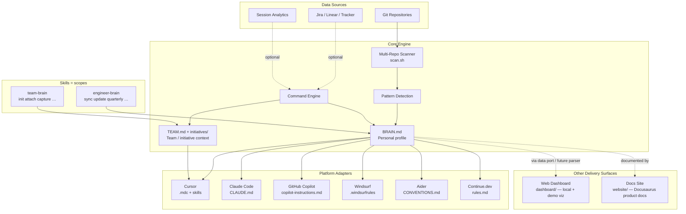
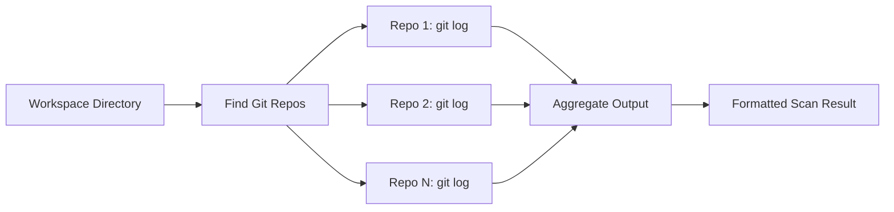
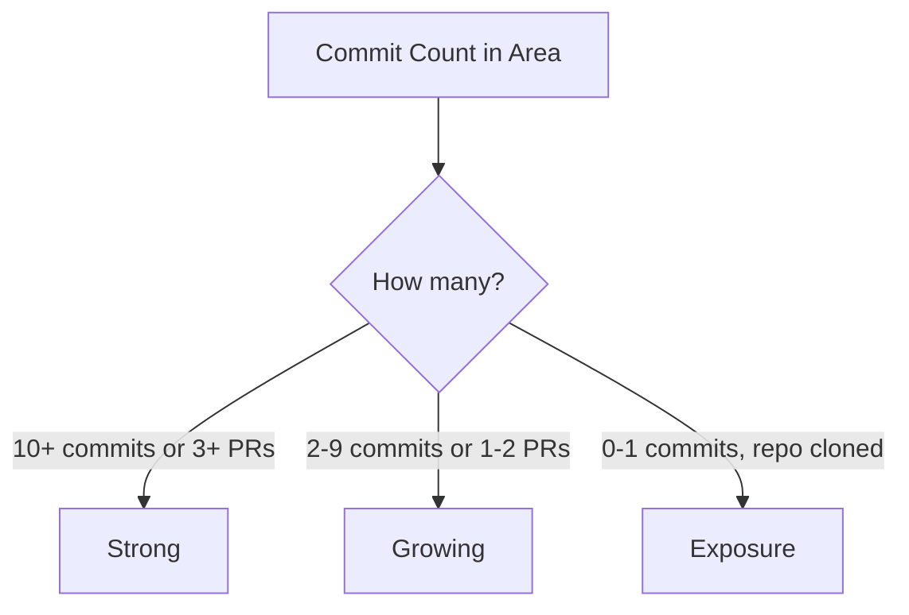
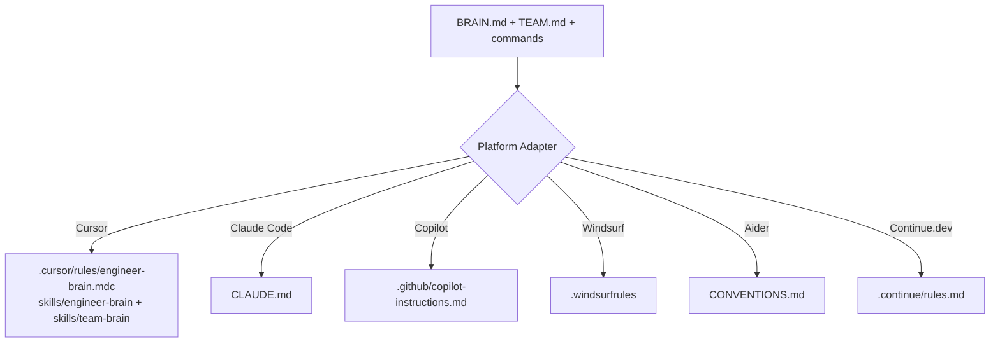
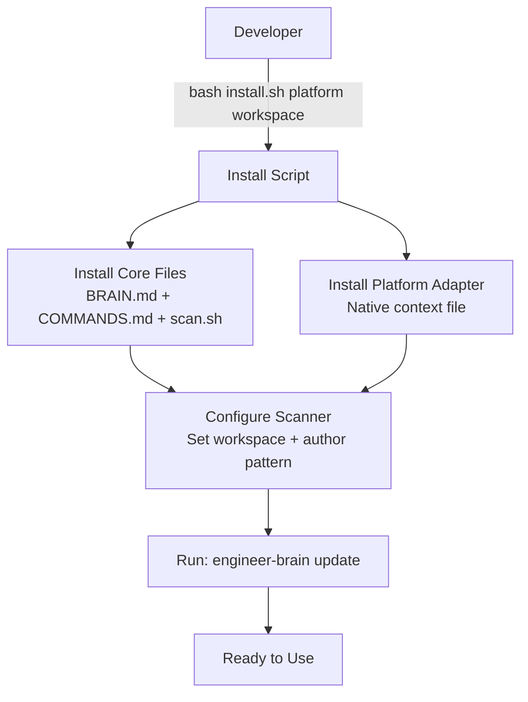
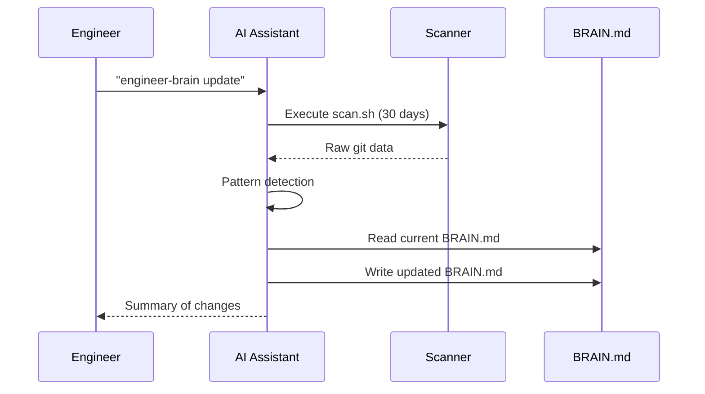

# Architecture

Brain is composed of three layers: data collection, intelligence, and delivery —
with two **scopes** (skills): engineer-brain (personal) and team-brain (team/initiative).

See also [scopes.md](scopes.md) and [team-brain.md](team-brain.md).

---

## System Overview

---

## Layer 1: Data Collection

### Multi-Repo Scanner (`core/scripts/scan.sh`)

The scanner is a bash script that traverses all git repositories in a workspace and extracts:

- **Recent commits** — Subject, author, date, type (fix/feat/refactor/test/chore)
- **Active branches** — Current branch, last commit date, ahead/behind status
- **Uncommitted changes** — Staged and unstaged modifications
- **Commit type breakdown** — Conventional commit prefix distribution
- **Files touched** — Which areas of the codebase are receiving attention
- **Velocity metrics** — Commits per day/week, trend direction
- **GitHub activity** (optional, via `gh`) — authored PRs, reviews given, recent releases
- **Personal-repo filtering** — optional `PERSONAL_REPOS` basenames excluded from team metrics

**Input:** Workspace path, author pattern, lookback period (days); optional `GH_OWNERS` / `RELEASE_REPOS`
**Output:** Structured text suitable for AI consumption

---

## Layer 2: Intelligence

### Pattern Detection

When processing scan output, the system applies heuristics:

| Pattern | Detection Rule | Action |
|---------|---------------|--------|
| Fix-heavy mode | >60% of commits are `fix:` | Flag in reflection |
| Cooling repo | Previously active repo with 30+ days no commits | Alert engineer |
| Velocity drop | >30% decrease week-over-week | Flag for attention |
| Stale growth goal | Unchecked checkbox for 30+ days | Escalate in reflection |
| New expertise | First commits in a new area | Celebrate in reflection |

### Expertise Classification

### Command Engine

Commands are natural language triggers interpreted by the AI assistant.
**Skills name the scope; commands are verbs** (do not install `sync` as its own skill).

| Skill | Command | Data Flow |
|-------|---------|-----------|
| engineer-brain | `sync` | Scanner (1-3 days) → BRAIN.md sprint context → Standup output |
| engineer-brain | `update` | Scanner (30 days) → Pattern detection → BRAIN.md rewrite |
| engineer-brain | `quarterly` | Scanner (90 days) → BRAIN.md → Structured review document |
| engineer-brain | `reflect` | Scanner (30 days) → Pattern detection → Recommendations |
| team-brain | `attach` / `sync` | TEAM.md + initiatives/*.md → session brief / team status |
| team-brain | `capture` / `breakdown` | Append findings → initiative file → story draft |

Team Brain sync is **hybrid**: Jira for initiative identity, **Supabase** for team membership + captures, and local `initiatives/<JIRA-KEY>.md` mirrors (one file per initiative). See [team-brain.md](team-brain.md) and [supabase/README.md](../supabase/README.md).

---

## Layer 3: Delivery (Platform Adapters)

Each AI coding assistant has its own native format for loading persistent context. Platform adapters translate the universal brain into the tool's expected format.

### Adapter contents

Each adapter file contains:
1. **Context section** — Condensed version of BRAIN.md identity, skills, and workspace info
2. **Behavior instructions** — How the AI should use the context (calibrate complexity, push growth, flag security)
3. **Command reference** — How to invoke engineer-brain commands in that platform's syntax
4. **Link to full brain** — Path to BRAIN.md for detailed lookups

### Web dashboard (`dashboard/`) vs docs site (`website/`)

| Path | Role | Data |
|------|------|------|
| `dashboard/` | Personal / demo visualization UI (Vite + React) | Consumes brain-shaped data via `loadDashboardData()` — sample fixture today; local `BRAIN.md` parser later |
| `website/` | Public product documentation (Docusaurus) | Static docs only — not a brain viewer |

The dashboard is a Delivery-layer **consumer** of BRAIN.md, not a second source of truth. Keep presentation (chart colors, layout) in the UI layer; keep taxonomy aligned with [brain-spec.md](brain-spec.md) (Strong / Growing / Exposure).

---

## Installation Flow

---

## Update Flow

---

## Security & Privacy

- All data stays local — nothing is transmitted to external services
- BRAIN.md lives in the engineer's workspace, versioned in their git repo
- The scanner reads only git metadata (commits, branches), not file contents
- No credentials, secrets, or sensitive data are stored in BRAIN.md
- Engineers can `.gitignore` their BRAIN.md if they prefer not to share it
- **Dashboard hosting:** public deploys (Vercel, Pages, etc.) may ship the **sample/demo** dashboard only. Do not upload personal `BRAIN.md` to a public host — use local `npm run dev` / `preview` for real brain data (see [dashboard/README.md](../dashboard/README.md))

---

## Extensibility

### Adding a new platform

1. Create `platforms/<name>/` directory
2. Add the context file in the platform's native format
3. Add a `README.md` with setup instructions
4. Add an install case to `install.sh`

### Adding a new data source

1. Create a new script in `core/scripts/`
2. Reference it from the relevant command in `COMMANDS.md`
3. Define how its output maps to BRAIN.md sections

### Adding a new command

1. Define the command in `core/COMMANDS.md`
2. Specify: trigger, data sources, output format, scope rules
3. For Cursor: also add to `platforms/cursor/skills/engineer-brain/SKILL.md`

### Extending the web dashboard

1. Add or update a data adapter under `dashboard/src/data/` (do not hard-import fixtures from `App.tsx`)
2. Keep `DashboardData` aligned with [brain-spec.md](brain-spec.md)
3. Put chart colors and other presentation details in the UI layer (`colors.ts` / components)
4. Document hosting/privacy constraints in `dashboard/README.md`
