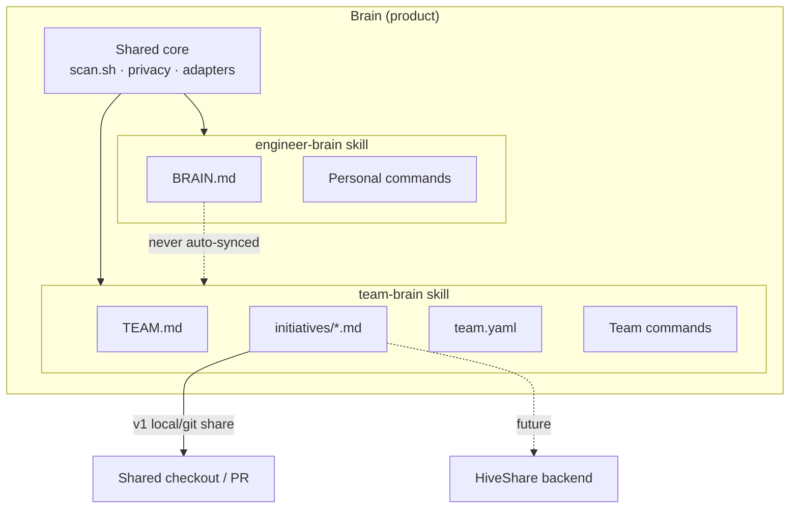

# Brain Scopes

Brain is the **product umbrella**. Two scopes ship as skills:

| Scope | Skill | Living documents | Typical commands |
|-------|-------|------------------|------------------|
| **Engineer** | `engineer-brain` | `BRAIN.md` | `sync`, `update`, `quarterly`, `reflect`, `scan`, `doctor` |
| **Team** | `team-brain` | `TEAM.md` + `initiatives/*.md` + `team.yaml` | `init`, `attach`, `sync`, `capture`, `breakdown`, `status` |

## Principles

1. **Skills = scopes; commands = verbs.** Do not promote `sync` / `quarterly` to top-level skills.
2. **Personal brain stays personal.** Team Brain reads opt-in captures only.
3. **Initiative-scoped team context.** Prefer `initiatives/<id>.md` over one mega team dump.
4. **Do not reimplement sync servers.** v1 is file/git-backed; realtime multi-agent memory is a future HiveShare adapter.

## Session load path

When an engineer attaches to an initiative:

1. Personal `BRAIN.md` (always — calibrate to the human)
2. `TEAM.md` (norms, repos, members)
3. `initiatives/<id>.md` (goal, decisions, findings)

## Demo walkthrough

1. `/engineer-brain sync` — personal standup  
2. `/team-brain init` — scaffold `.team-brain/` (or copy `examples/team-spike-crew/`)  
3. `/team-brain attach DEMO-EE-1` — load shared spike context  
4. `/team-brain capture DEMO-EE-1` — add a finding  
5. `/team-brain breakdown DEMO-EE-1` — draft stories from captures  

See [team-brain.md](team-brain.md) and issue tracking for HiveShare integration.
