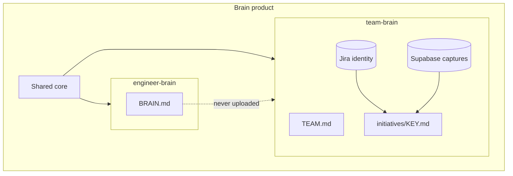

# Brain Scopes

Brain is the **product umbrella**. Two scopes ship as skills:

| Scope | Skill | Living documents | Typical commands |
|-------|-------|------------------|------------------|
| **Engineer** | `engineer-brain` | `BRAIN.md` | `sync`, `update`, `quarterly`, `reflect`, `scan`, `doctor` |
| **Team** | `team-brain` | `TEAM.md` + **`initiatives/<JIRA-KEY>.md` (one per initiative)** | `register`, `join`, `attach`, `capture`, `sync`, `breakdown` |

## Principles

1. Skills = scopes; commands = verbs.
2. Personal brain stays personal.
3. **One initiative → one markdown file** named by Jira key.
4. Hybrid sync: Jira identity + Supabase captures + local md mirror.

## Demo walkthrough

1. Apply `supabase/migrations` (see [supabase/README.md](../supabase/README.md))
2. `/team-brain register "Spike Crew"`
3. Teammate `/team-brain join <invite>`
4. `/team-brain attach AAP-81423` (Jira + Supabase + md)
5. `/team-brain capture` → teammate `/team-brain sync`
6. `/engineer-brain sync` still personal-only

Details: [team-brain.md](team-brain.md).
