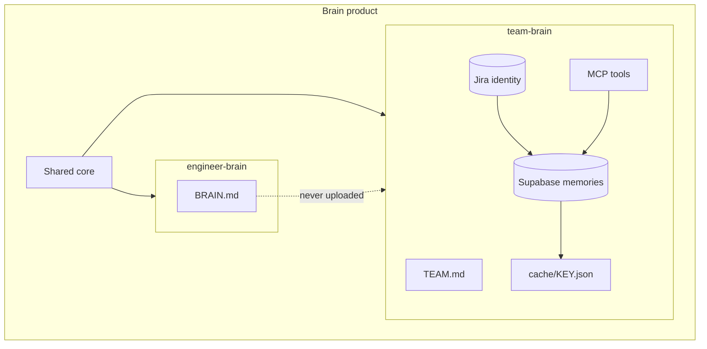

# Brain Scopes

Brain is the **product umbrella**. Two scopes ship as skills:

| Scope | Skill | Living documents | Typical commands |
|-------|-------|------------------|------------------|
| **Engineer** | `engineer-brain` | `BRAIN.md` | `sync`, `update`, `quarterly`, `reflect`, `scan`, `doctor` |
| **Team** | `team-brain` | Supabase memories + `cache/<KEY>.json` (+ optional md export) | `onboard`, `attach`, `remember`, `recall`, `breakdown`, `watch` |

## Principles

1. Skills = scopes; commands = verbs.
2. Personal brain stays personal — never uploaded to Team Brain.
3. **One initiative → one Jira key** (cache + optional `initiatives/<KEY>.md`).
4. Collaborative memory: Jira identity + Supabase SoT + local cache; md is export.
5. **Agent loop (mandatory in Cursor):** `recall` before research on a key; `remember` after durable findings (`source_ref`); `breakdown` consumes recall.
6. Joiners need only invite code + Jira key (`onboard`); URL/anon key live in `supabase/project.public.env`.

## Demo walkthrough

1. Apply `supabase/migrations` (see [supabase/README.md](../supabase/README.md))
2. Admin: `register "Spike Crew" "Alice"` → share invite
3. Teammate: `onboard <invite> "Name" AAP-81423`
4. Agents/`remember` / `recall` / `breakdown` (or MCP tools)
5. Optional: wire [mcp/team-brain](../mcp/team-brain/README.md); Cursor installs `team-brain.mdc` always-on rule
6. `/engineer-brain sync` still personal-only

| Guide | Link |
|-------|------|
| Beginner onboarding | [team-brain-onboarding.md](team-brain-onboarding.md) |
| Overview | [team-brain.md](team-brain.md) |
| Memory plan (P0–P4) | [team-brain-memory.md](team-brain-memory.md) |
| Architecture | [architecture.md](architecture.md) |
