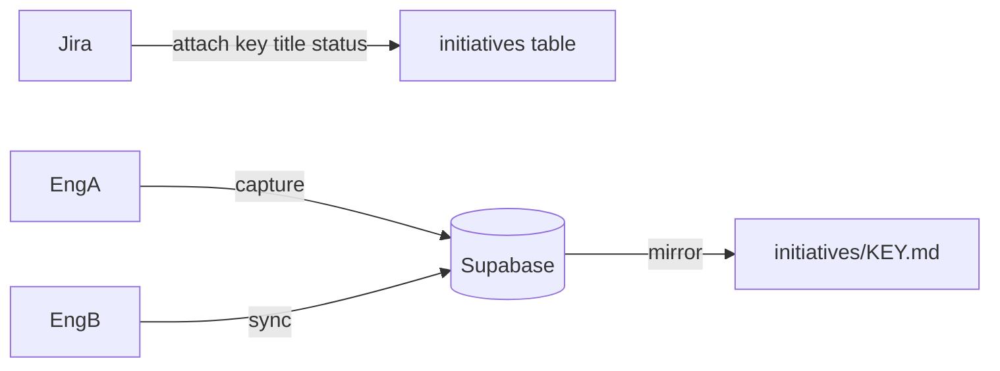

# Team Brain

Shared, opt-in context for crews on the same spike, epic, or initiative.

Part of **Brain** alongside [engineer-brain](scopes.md). See also [#2](https://github.com/Hrithik-Gavankar/engineer-brain/issues/2).

## Layout (one markdown file per initiative)

```
.team-brain/
├── team.yaml
├── credentials.json          # gitignored — from register/join
├── TEAM.md                   # one per team
└── initiatives/
    ├── AAP-81423.md          # one file PER Jira initiative
    └── DEMO-EE-1.md
```

## Hybrid sync

| Layer | Responsibility |
|-------|----------------|
| **Jira** | Initiative identity — key, summary, status, browse URL |
| **Supabase** | Team register/join + shared **captures** across engineers |
| **Local `.md`** | Human-readable mirror (Capture log refreshed on `sync` / `capture`) |



Setup Supabase: **[supabase/README.md](../supabase/README.md)**.

## Onboard (new teammate)

Share **only the invite code** (+ Jira key). URL/anon key are already in the repo.

```bash
bash core/scripts/team-brain-api.sh onboard 9F7AC910 "Bob" AAP-81423
```

Admin creates the team once: `register "Team Atlas" "Alice"` → share `invite_code`.

## Attach (Jira) → capture → sync

1. `/team-brain attach AAP-81423` — skill fetches Jira (Atlassian MCP), then:

```bash
bash core/scripts/team-brain-api.sh attach AAP-81423 "Summary" "Review" "https://redhat.atlassian.net/browse/AAP-81423"
```

2. `/team-brain capture AAP-81423` — writes capture to Supabase + mirrors `initiatives/AAP-81423.md`.
3. Teammate: `/team-brain sync AAP-81423` — pulls their captures into the same md file.

## Fallback

`sync.backend: local` — file/git only (no Supabase). Useful offline; not multi-engineer realtime.

## Privacy

- Personal `BRAIN.md` never goes to Supabase
- Do not commit `credentials.json`
- Captures are team-visible by design — keep them professional

## Commands

Full reference: [core/team/TEAM_COMMANDS.md](../core/team/TEAM_COMMANDS.md)  
Cursor skill: [platforms/cursor/skills/team-brain/SKILL.md](../platforms/cursor/skills/team-brain/SKILL.md)
