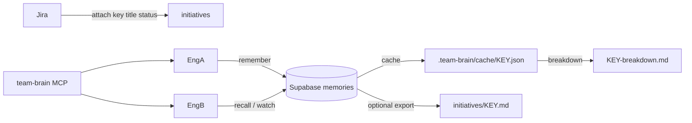

# Team Brain

Shared, opt-in **collaborative AI memory** for crews on the same spike, epic, or initiative.

Part of **Brainstack** alongside [engineer-brain](scopes.md). See also [#2](https://github.com/Hrithik-Gavankar/brainstack/issues/2).

| Doc | Audience |
|-----|----------|
| **[team-brain-onboarding.md](team-brain-onboarding.md)** | Juniors — invite + Jira key, 10-minute path |
| **[team-brain-memory.md](team-brain-memory.md)** | Plan / phases (P0–P4) and honesty about sync |
| **[mcp/team-brain/README.md](../mcp/team-brain/README.md)** | Agent MCP tools |
| **[supabase/README.md](../supabase/README.md)** | Project env, security, migrations |

## Layout

```
.team-brain/
├── team.yaml                 # sync backend, jira site, initiative index
├── credentials.json          # gitignored — from register / join / onboard
├── TEAM.md                   # one per team (norms, members)
├── cache/
│   └── YOU_JIRA_TICKET_HERE.json        # agent-facing snapshot (written on attach/remember/recall)
├── metrics.json              # gitignored — local reuse stats
└── initiatives/
    ├── YOU_JIRA_TICKET_HERE.md          # optional human/git export
    └── YOU_JIRA_TICKET_HERE-breakdown.md
```

## Sync model

| Layer | Responsibility |
|-------|----------------|
| **Jira** | Initiative identity — key, summary, status, browse URL |
| **Supabase** | Team register/join + shared **memories** (source of truth) |
| **Local cache** | `.team-brain/cache/<KEY>.json` for agents |
| **Local `.md`** | Optional human/git **export** (not the sync bus) |



**Honesty:** sync is not automatic chat sync. Shared memory requires `remember`, then `recall` (or the Cursor agent loop / MCP / optional `watch` poll). Agents get a soft MCP-first compliance gate (`compliance` / `prepare_research`); the CLI is not hard-blocked. Peer push (#31) is **full-content** Realtime Broadcast — the body travels app-layer encrypted and a peer holding the team's `broadcast_key` decrypts it locally (zero extra round-trip); anyone without the key, or a pre-migration/`restore`d row, falls back to authenticated pull — poll remains the always-on safety net either way. Semantic recall (#4) is a one-command opt-in: `enable-semantic <openai|ollama>`. Repo pin (#39): commit `.team-brain/project.json` (no secrets). Roles (#40): `viewer` is read-only; only `admin` rotates invites.

## Onboard (new teammate)

Admin provisions **their own** Supabase project (see [supabase/README.md](../supabase/README.md)). Repo ships placeholders only in `supabase/project.public.env`.

Share with joiners: **invite code + project URL + anon key + Jira key** (not via public git).

```bash
bash core/scripts/team-brain-api.sh onboard <INVITE> "Bob" YOU_JIRA_TICKET_HERE
```

Admin once: create project → migrations → `register "Team Atlas" "Alice"` → share invite (16 hex chars).

## Sync mode (product loop)

One manual step when you start team work on a ticket.

**In Cursor / chat (preferred):**

```text
I'm starting on YOU_JIRA_TICKET_HERE — start Team Brain sync.
```

```text
I'm starting on YOU_JIRA_TICKET_HERE — start Team Brain sync, summarize crew memory, then help me.
```

```text
/team-brain start YOU_JIRA_TICKET_HERE
```

| Later | Say |
|-------|-----|
| After idle sleep | `Wake Team Brain sync for YOU_JIRA_TICKET_HERE and continue.` |
| Done | `Stop Team Brain sync for YOU_JIRA_TICKET_HERE.` |

**CLI equivalent:**

```bash
bash core/scripts/team-brain-api.sh start YOU_JIRA_TICKET_HERE
```

| While active | Behavior |
|--------------|----------|
| Pull | Background merge-safe poll → `cache/<KEY>.json` |
| Push | `remember` — identical no-op; same `source_ref` + new body → **update** |
| Awake | `touch` / recall / remember refresh activity |
| Idle ~1h | **sleep** (warn ~5m before); `wake` or `start` to resume |
| Done | `stop` |

Cursor rule/skill: summarize cache after `start`; prompt user if mode is `sleep`.

## Attach → start → remember → breakdown

1. Attach (or let `start` attach) the Jira key.
2. `start` — load crew memory + enter sync mode.
3. Agents/`remember` with `source_ref`.
4. `breakdown` / `metrics` when planning; `metrics --team` for crew coverage + reuse (#35).

```bash
bash core/scripts/team-brain-api.sh breakdown YOU_JIRA_TICKET_HERE
bash core/scripts/team-brain-api.sh metrics YOU_JIRA_TICKET_HERE
bash core/scripts/team-brain-api.sh metrics --team
```

`capture` / `sync` / `watch` remain as lower-level aliases.

## Fallback

`sync.backend: local` — file/git only (no Supabase). Useful offline; not multi-engineer realtime.

## Readiness check

```bash
bash core/scripts/team-brain-api.sh doctor
```

Client-side preflight: dependencies (curl/jq/openssl/python3), Supabase config, migrations applied, push mode (full/signal/poll), embedding provider. Run this first when something feels broken.

## Privacy

- Personal `BRAIN.md` never goes to Supabase
- Do not commit `credentials.json` or Supabase `service_role`
- Memories are team-visible by design — keep them professional

## Commands

Full reference: [core/team/TEAM_COMMANDS.md](../core/team/TEAM_COMMANDS.md)  
Cursor skill: [platforms/cursor/skills/team-brain/SKILL.md](../platforms/cursor/skills/team-brain/SKILL.md)
