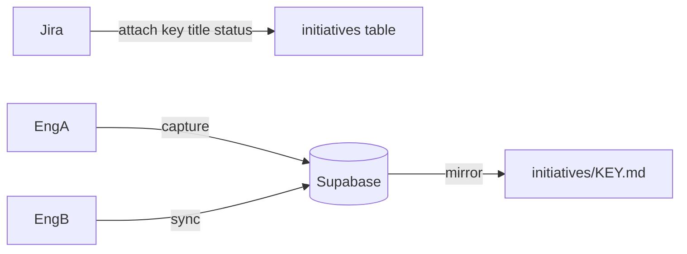

# Team Brain

Shared, opt-in **collaborative AI memory** for crews on the same spike, epic, or initiative.

Part of **Brain** alongside [engineer-brain](scopes.md). See also [#2](https://github.com/Hrithik-Gavankar/engineer-brain/issues/2).

**Memory roadmap:** [team-brain-memory.md](team-brain-memory.md)  
**MCP (P3):** [mcp/team-brain/README.md](../mcp/team-brain/README.md)

## Layout (one markdown file per initiative)

```
.team-brain/
├── team.yaml
├── credentials.json          # gitignored — from register/join
├── TEAM.md                   # one per team
└── initiatives/
    ├── AAP-81423.md          # one file PER Jira initiative
    └── DEMO-EE-1.md
```

## Hybrid sync

| Layer | Responsibility |
|-------|----------------|
| **Jira** | Initiative identity — key, summary, status, browse URL |
| **Supabase** | Team register/join + shared **memories** (source of truth) |
| **Local cache** | `.team-brain/cache/<KEY>.json` for agents (written on sync/remember) |
| **Local `.md`** | Optional human/git **export** (not the sync bus) |



Setup Supabase: **[supabase/README.md](../supabase/README.md)**.

## Onboard (new teammate)

Share **only the invite code** (+ Jira key). URL/anon key are already in the repo.

```bash
bash core/scripts/team-brain-api.sh onboard 9F7AC910 "Bob" AAP-81423
```

Admin creates the team once: `register "Team Atlas" "Alice"` → share `invite_code`.

## Attach (Jira) → remember → recall

1. `/team-brain attach AAP-81423` — skill fetches Jira, upserts initiative, **pulls recent memories into cache**.

```bash
bash core/scripts/team-brain-api.sh attach AAP-81423 "Summary" "Review" "https://your-org.atlassian.net/browse/AAP-81423"
```

2. `/team-brain remember AAP-81423 research "…"` — writes memory (dedup by `source_ref` / content hash).
3. Teammate: `/team-brain recall AAP-81423` or `recall AAP-81423 auth flow` — list recent or FTS search.

`capture` / `sync` remain as aliases.

## Breakdown (P4)

```bash
bash core/scripts/team-brain-api.sh breakdown AAP-81423
bash core/scripts/team-brain-api.sh metrics AAP-81423
```

Recalls team memories first, writes `initiatives/<KEY>-breakdown.md` (stories/spikes/AC drafts), and tracks reuse in gitignored `metrics.json`.

## Fallback

`sync.backend: local` — file/git only (no Supabase). Useful offline; not multi-engineer realtime.

## Privacy

- Personal `BRAIN.md` never goes to Supabase
- Do not commit `credentials.json`
- Captures are team-visible by design — keep them professional

## Commands

Full reference: [core/team/TEAM_COMMANDS.md](../core/team/TEAM_COMMANDS.md)  
Cursor skill: [platforms/cursor/skills/team-brain/SKILL.md](../platforms/cursor/skills/team-brain/SKILL.md)
