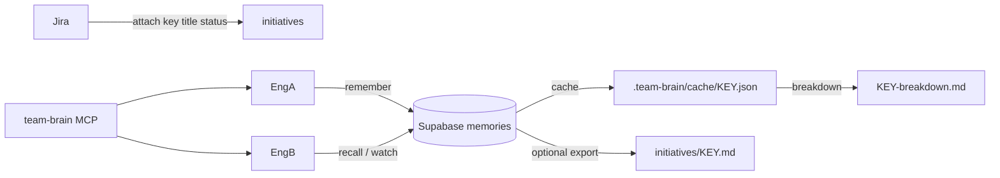

# Team Brain

Shared, opt-in **collaborative AI memory** for crews on the same spike, epic, or initiative.

Part of **Brain** alongside [engineer-brain](scopes.md). See also [#2](https://github.com/Hrithik-Gavankar/engineer-brain/issues/2).

| Doc | Audience |
|-----|----------|
| **[team-brain-onboarding.md](team-brain-onboarding.md)** | Juniors — invite + Jira key, 10-minute path |
| **[team-brain-memory.md](team-brain-memory.md)** | Plan / phases (P0–P4) and honesty about sync |
| **[mcp/team-brain/README.md](../mcp/team-brain/README.md)** | Agent MCP tools |
| **[supabase/README.md](../supabase/README.md)** | Project env, security, migrations |

## Layout

```
.team-brain/
├── team.yaml                 # sync backend, jira site, initiative index
├── credentials.json          # gitignored — from register / join / onboard
├── TEAM.md                   # one per team (norms, members)
├── cache/
│   └── AAP-81423.json        # agent-facing snapshot (written on attach/remember/recall)
├── metrics.json              # gitignored — local reuse stats
└── initiatives/
    ├── AAP-81423.md          # optional human/git export
    └── AAP-81423-breakdown.md
```

## Sync model

| Layer | Responsibility |
|-------|----------------|
| **Jira** | Initiative identity — key, summary, status, browse URL |
| **Supabase** | Team register/join + shared **memories** (source of truth) |
| **Local cache** | `.team-brain/cache/<KEY>.json` for agents |
| **Local `.md`** | Optional human/git **export** (not the sync bus) |



**Honesty:** sync is not automatic chat sync. Shared memory requires `remember`, then `recall` (or the Cursor agent loop / MCP / optional `watch` poll).

## Onboard (new teammate)

Share **only the invite code** (+ Jira key). URL/anon key ship in `supabase/project.public.env`.

```bash
bash core/scripts/team-brain-api.sh onboard <INVITE> "Bob" AAP-81423
```

Admin creates the team once: `register "Team Atlas" "Alice"` → share `invite_code` (16 hex chars on new teams).

## Agent loop (shared brain)

Cursor ships an always-on rule (`platforms/cursor/rules/team-brain.mdc`) + skill so agents **must**:

1. **`recall` before research** on a Jira key (sync crew memory)
2. **`remember` immediately after** durable findings (`source_ref` for dedup)

Humans can still run CLI; juniors see [team-brain-onboarding.md](team-brain-onboarding.md).

## Attach → remember → recall → breakdown

1. `/team-brain attach AAP-81423` — skill fetches Jira, upserts initiative, **pulls recent memories into cache**.

```bash
bash core/scripts/team-brain-api.sh attach AAP-81423 "Summary" "Review" "https://your-org.atlassian.net/browse/AAP-81423"
```

2. Agents/`remember` — write memory (dedup by `source_ref` / content hash).
3. Teammates/`recall` — list recent or search before they dig.
4. `breakdown` / `metrics` — draft stories from recall; track reuse locally.

```bash
bash core/scripts/team-brain-api.sh breakdown AAP-81423
bash core/scripts/team-brain-api.sh metrics AAP-81423
```

`capture` / `sync` remain as aliases for remember / recall-recent.

## Fallback

`sync.backend: local` — file/git only (no Supabase). Useful offline; not multi-engineer realtime.

## Privacy

- Personal `BRAIN.md` never goes to Supabase
- Do not commit `credentials.json` or Supabase `service_role`
- Memories are team-visible by design — keep them professional

## Commands

Full reference: [core/team/TEAM_COMMANDS.md](../core/team/TEAM_COMMANDS.md)  
Cursor skill: [platforms/cursor/skills/team-brain/SKILL.md](../platforms/cursor/skills/team-brain/SKILL.md)
