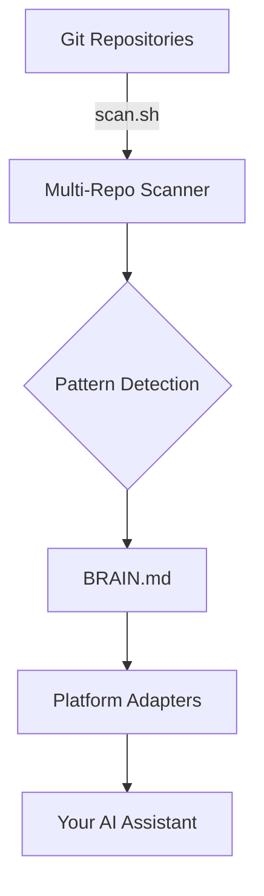

# Architecture

Engineer Brain is composed of three layers: data collection, intelligence, and delivery.

## System Overview

## Layer 1: Data Collection

The **scanner** (`core/scripts/scan.sh`) traverses all git repositories and extracts commits, branches, patterns, and velocity metrics.

## Layer 2: Intelligence

**Pattern detection** analyzes scanner output to classify expertise, detect anomalies, and generate recommendations.

## Layer 3: Delivery

**Platform adapters** translate the universal brain into each tool's native context format.

## Full Documentation

See the [complete architecture document](https://github.com/Hrithik-Gavankar/engineer-brain/blob/main/docs/architecture.md) for detailed diagrams and data flow explanations.
