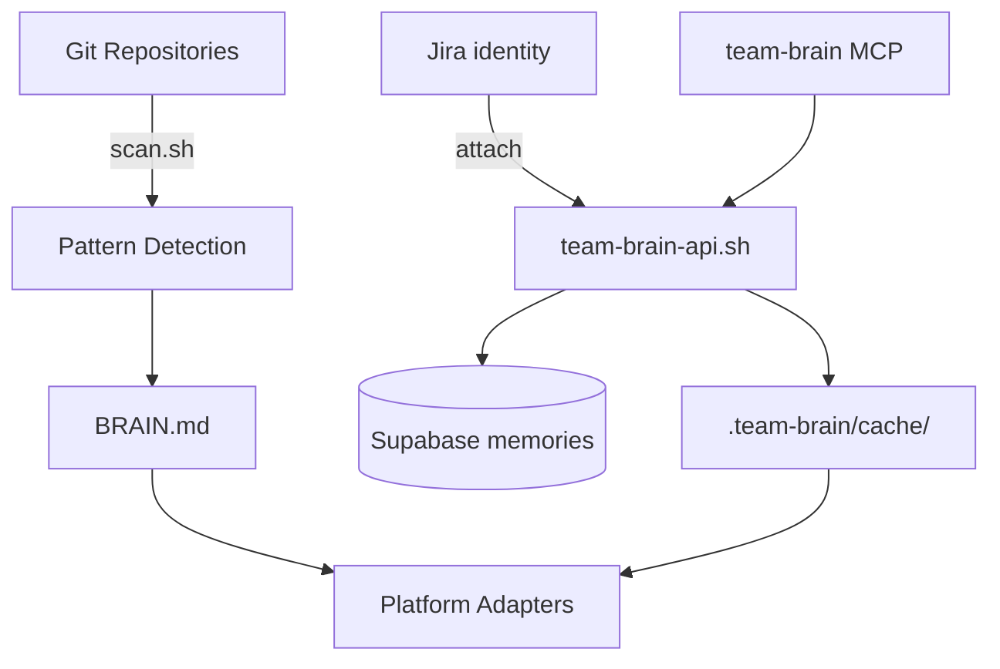

# Architecture

Engineer Brain has two **scopes** (skills): personal `engineer-brain` and opt-in `team-brain`.

## System overview

## Layers

1. **Data collection** — multi-repo git scanner (`scan.sh`)
2. **Intelligence** — pattern detection + command engine (personal) and collaborative memory RPCs (team)
3. **Delivery** — platform adapters; Cursor also ships always-on `team-brain.mdc` (recall / remember loop)

## Team Brain

| Layer | Role |
|-------|------|
| Jira | Initiative identity |
| Supabase | Membership + memories (source of truth) |
| Local cache | Agent-facing snapshot |
| Markdown | Optional export |
| MCP | Agent tools without shelling out |

**Honesty:** shared memory is not automatic chat sync — agents/`remember`, then `recall` (or MCP / `watch`).

## Full documentation

See the [complete architecture document](https://github.com/Hrithik-Gavankar/engineer-brain/blob/main/docs/architecture.md) for detailed diagrams, security notes, and extensibility.
